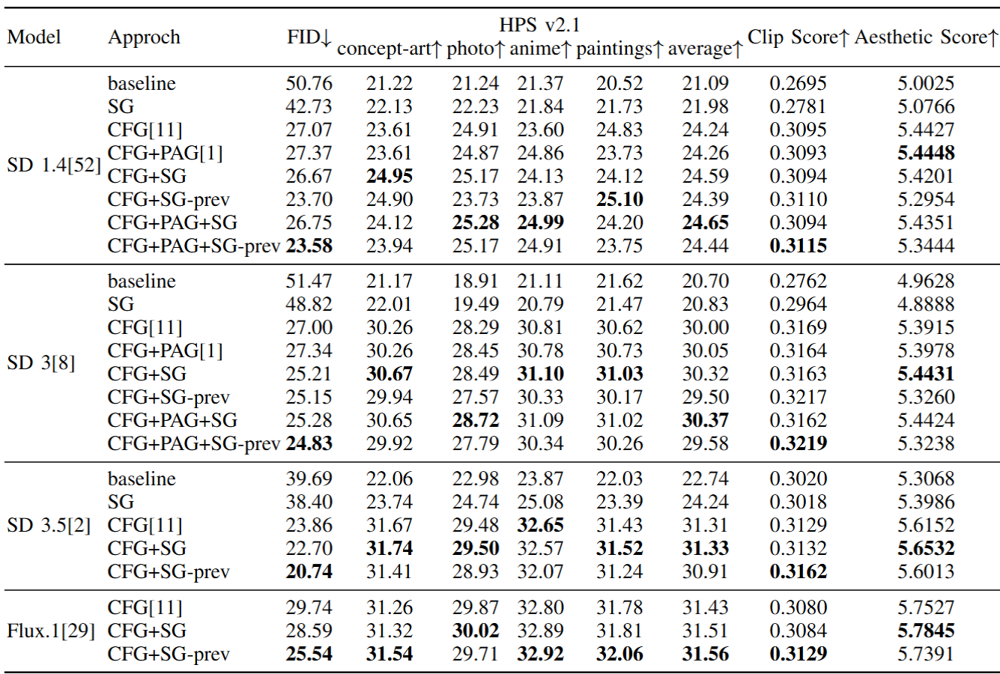

<div align="center">

<h1>Self-Guidance: Boosting Flow and Diffusion Generation on Their Own</h1>
<p align="center">
<a href="https://arxiv.org/pdf/2412.05827"></a>
</p>

[MAPLE Lab, Westlake University](https://maple.lab.westlake.edu.cn/)

</div>


## News

- ```[July 2025]``` We release our code for inference and evaluation.

## OverView
In this paper, we observe that the ratio of probabilities at different noise
levels serves as a good indicator of artifacts during the reverse diffusion process.

Leveraging this insight, we propose **S**elf-**G**uidance (**SG**) —a plug-and-play guidance method to modulate the output distribution at each denoising step via incorporating the difference between the output probability distributions computed at both current time $t$ and a noisier one $t+\delta(t)$. 

Moreover, such guidance can be implemented without incurring additional inference cost, we refer to as **SG-prev**, which approximates SG by directly reusing the output from the immediately previous timestep.


Conpared to existing diffusion guidance strategy, SG has multiple advantages:
- **architecture independence**: SG is independent of neural architectures, meaning that it can be deployed freely on diffusion and flow models based on different neural architectures regardless of whether it is a UNet-based model or a Transformer-based model.
- **requiring no specific training**: SG does not require any additional model training and can be used in a plug-and-play manner.
- **compatibility with other well-established guidance methods**: SG is compatible with other guidance on both UNet and DiT-based diffusion models for text-to-image and text-to-video generation tasks.


## Getting Started

You can try a demo in `demo.ipynb`.

### Installation
```python
git clone https://github.com/maple-research-lab/Self-Guidance.git
cd Self-Guidance
pip install -e . 
```

### Using SG with Stable Diffusion (e.g. Stable Diffusion 3)
#### Loading Custom Pipeline
```python
from models.stable_diffusion_3.pipeline_sd_3 import StableDiffusion3SGPAGPipeline
pipe = StableDiffusion3SGPAGPipeline.from_pretrained(
    "stabilityai/stable-diffusion-3-medium",
    torch_dtype=torch.float16,
)

device="cuda"
pipe = pipe.to(device)

prompts = ["a photograph of an astronaut riding a horse"]
```
#### Sampling with CFG + PAG + SG
```python
output = pipe(
    prompts,
    width=1024,
    height=1024,
    num_inference_steps=28,
    guidance_scale=7.5,
    pag_scale=0.7,
    self_guidance_scale=3,
    self_guidance_shift_t=10,
    self_guidance_type="sg"
).images[0]
```
#### Sampling with CFG + PAG + SG_prev
```python
output = pipe(
    prompts,
    width=1024,
    height=1024,
    num_inference_steps=28,
    guidance_scale=7.5,
    pag_scale=0.7,
    self_guidance_scale=3,
    self_guidance_shift_t=10,
    self_guidance_type="sg_prev",
    sg_prev_max_t=500
).images[0]
```

### Using SG with Flux.1
#### Loading Custom Pipeline
```python
from models.flux.pipeline_flux import FluxSGPipeline
pipe = FluxSGPipeline.from_pretrained(
    "black-forest-labs/FLUX.1-dev",
    torch_dtype=torch.bfloat16,
)

device="cuda"
pipe = pipe.to(device)

prompts = ["a photograph of an astronaut riding a horse"]
```
#### Sampling with CFG + SG
```python
output = pipe(
    prompts,
    width=1024,
    height=1024,
    num_inference_steps=28,
    guidance_scale=3.5,
    self_guidance_scale=1,
    self_guidance_shift_t=10,
    self_guidance_type="sg"
).images[0]
```
#### Sampling with CFG + SG_prev
```python
output = pipe(
    prompts,
    width=1024,
    height=1024,
    num_inference_steps=28,
    guidance_scale=3.5,
    self_guidance_scale=3,
    self_guidance_shift_t=10,
    self_guidance_type="sg_prev",
    sg_prev_max_t=500
).images[0]
```

### Using SG with CogVideoX
#### Loading Custom Pipeline
```python
from models.cogvideox.pipeline_cogvideox import CogVideoXSGPipeline
pipe = CogVideoXSGPipeline.from_pretrained(
    "THUDM/CogVideoX-5b",
    torch_dtype=torch.bfloat16,
)

device="cuda"
pipe = pipe.to(device)

prompts = ["A panda sits on a wooden stool in a serene bamboo forest."]
```
#### Sampling with CFG + SG
```python
output = pipe(
    prompts,
    width=720,
    height=480,
    num_inference_steps=50,
    guidance_scale=6,
    self_guidance_scale=3,
    self_guidance_shift_t=10,
    self_guidance_type="sg"
).frames[0]
```
#### Sampling with CFG + SG_prev
```python
output = pipe(
    prompts,
    width=720,
    height=480,
    num_inference_steps=50,
    guidance_scale=6,
    self_guidance_scale=3,
    self_guidance_shift_t=10,
    self_guidance_type="sg_prev",
    sg_prev_max_t=500
).frames[0]
```

### Evaluation
#### Sampling from coco_2017_val 5000 prompts (e.g. Stable Diffusion 3)
```python
accelerate launch inference/coco.py \
    --config config/sd3.yaml \
    --local_data_path data/coco/coco_val5000_prompts.txt \
    --output runs/sd3/coco \
    --seed 0 
```
#### Sampling from HPS v2 prompts (e.g. Stable Diffusion 3)
```python
accelerate launch inference/hps.py \
    --config config/sd3.yaml \
    --local_data_path data/hps \
    --output runs/sd3/hps \
    --seed 0 
```

#### Sampling from VBench prompts (e.g. CogVideoX)
```python
accelerate launch inference/vbench.py \
    --config config/cogvideox.yaml \
    --local_data_path data/vbench \
    --output runs/cogvideox/vbench \
    --seed 0 
```
#### Evaluate with FID, CLIP Score, Aesthetic Score and HPS v2
```python
python evaluation/evaluate.py \
--coco_data_path /path/to/coco/results \
--hps_data_path /path/to/hps/results \
--prompt_path data/coco/coco_val5000_prompts.txt \
--fid --clip --aes --hps
```


<div align="center"><strong>Evaluation Metrics</strong>



</div>

## Citation
If this repository helps with your work, please consider giving a star and citation:
```
@article{li2024self,
  title={Self-Guidance: Boosting Flow and Diffusion Generation on Their Own},
  author={Li, Tiancheng and Luo, Weijian and Chen, Zhiyang and Ma, Liyuan and Qi, Guo-Jun},
  journal={arXiv preprint arXiv:2412.05827},
  year={2024}
}
```